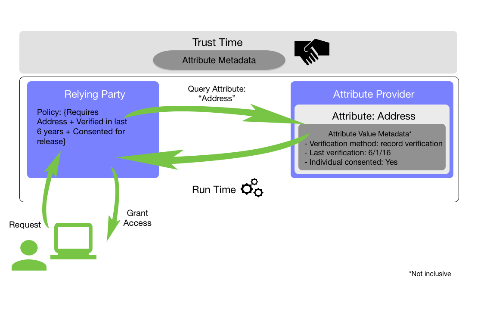

## 3. Metadata

The term *attribute* is used throughout this document to refer to a defined characteristic of an individual — often referred to as subject attributes. *Home address* is one example of an attribute of a person. The term *attribute value* is used throughout to refer to a specifically assigned value for an attribute; for example, Jane Doe's *home address* is *1 Main St., Anytown, VA 11111*. Attribute providers collect and maintain these elements—the attribute and its value[s]—together. In a federated environment, these attributes are asserted to the relying party (RP) to support the provision of a benefit or service, or when authorizing access to a protected resource. 

Attributes and attribute values may also be associated with devices or non-person entities; however, these entities are not addressed in this document. For the purposes of this document, all attributes are deemed to be personally identifiable information (PII), and organizations should consider any security risks related to transmitting and retaining attributes, in addition to the various privacy considerations provided in this document.

Oftentimes, a set of asserted attributes and their values is enough on its own to support access to systems or applications. In the instance above, the information provided may be sufficient to allow Jane to benefit from a service her town provides for residents. Alternatively, in more sensitive contexts (e.g., national security systems, systems that enable access to personally identifiable information), RPs may want additional information about the specific attributes and attribute values they are receiving. Who provided Jane's home address? Did she self-assert it, or did the AP retrieve it from a database, such as the DMV or her employer? These _data of the attributes_, or *metadata*, enable the RP to interrogate the attribute value *and* information about the value itself during authorization policy evaluation. Information about the value may include where the attribute came from, whether it has been verified, and how often it is updated.  This allows the RP to make a more informed decision about whether or not to *trust* an attribute when making access control decisions.

The ASM and AVM listed in each section of this schema are not mandatory. Collectively, these elements aim to support transactional needs in federations and trust frameworks across the private and public sectors. NIST envisions that communities and federations will leverage the included metadata elements to develop their own profiles. In addition, this schema supports extensibility for instances when the information contained herein is not sufficient for federated partners.

When implementing this schema, organizations must evaluate and understand both the authorization considerations **and** the privacy implications associated with a given use case or transaction type. With the additional granularity that attribute schema and attribute value metadata can provide, new information can be revealed which may provide a broader profile of an individual than was intended or anticipated. For instance, asserting that the verifier of Jane's address is her employer reveals more than just *1 Main St., Anytown, VA* to the receiving entity. The receiving entity now knows who she works for in addition to where she resides, something that Jane may not be aware of and may not wish to reveal. 

When deciding which metadata elements to select, the involved parties should conduct a privacy risk assessment to consider these possibilities, and to identify the potential negative impacts to privacy that could arise from including certain metadata elements. To assist with this privacy risk assessment process, privacy considerations associated with the metadata elements are included throughout this document. This is certainly not an exhaustive list; there might be additional privacy considerations apart from those listed, and the listed considerations might change over time. Ultimately, the listed considerations may aid in deciding which elements of metadata to include, maximizing the benefit of a transaction while minimizing problems for the individuals associated with the metadata. If a metadata element does reveal information about an individual, but is still necessary to a transaction and thus must be included, the appropriate parties should consider how to provide visibility of the metadata to the individual, so he or she can predict the transfer of certain information.

### 3.1. Attribute Schema Metadata

ASM provide information that is applicable to the attribute being asserted, regardless of the value of that attribute. ASM are intended to be static, discussed, and agreed upon by federated parties in advance of the actual assertion.  For this reason, ASM are considered "trust-time" metadata and can be encapsulated in agreements such as attribute provider statements (APS), contracts, or trust frameworks. [Table 1](#table1) provides the list of ASM that organizations can consider when establishing identity federation agreements. This is unlike AVM, which are dynamic and thus asserted and evaluated at run-time.

 **Table 1: Attribute Schema Metadata**

| Metadata            | Description                                                                          | Recommended Values                                        |
| ------------------- |------------------------------------------------------------------------------------|---------------------------------------------|
| **Description** | An informative description of the attribute                                                      |                         Any                      |  
| **Allowed Values** | A defined set of allowed values for the attribute         |             Any                                  |                                                    
|**Format**| A defined format in which the attribute will be expressed| Any|
| **Verification Frequency** |The frequency at which the AP will re-verify the attribute| Any |
| **Data Processing** | Describes the basis for processing attributes and attribute values | Any |

#### 3.1.1. Description

The `description` metadata element ensures that all entities participating in the federation of attributes have the same semantic understanding of the attribute. This enables both trust and interoperability by providing a common understanding of what the attribute and its value(s) represent. There are no set values for this metadata element as it is intended to be a free form, text-based definition.

#### 3.1.2. Allowed Values

This metadata element provides a common, agreed-to set of values for an attribute. This ensures that when an AP transmits the attribute, the receiving organization is able to appropriately process the values. Variations between provider and RP in expressing values for an attribute—for example, a value outside of an expected range—adversely impact interoperability and performance of authorization activities. For this reason, providing information for the resolution of this metadata element is highly recommended.

#### 3.1.3. Format

This metadata element describes the format for expressing attribute's value. For example, the attribute `height` may always be expressed in meters rather than centimeters. As with `allowed values`, up front agreement around the format of expressed attributes supports technical interoperability of assertions during run-time as well as appropriate policy evaluation of the attributes when determining access to resources.

#### 3.1.4. Verification Frequency

In most situations, it is highly beneficial for the RP and the AP to agree to set rates for periodic verification of attribute values. This metadata element captures the frequency with which this re-verification occurs, to ensure that both parties have established valid verification intervals. When determining if verification frequency is appropriate to include for a particular attribute, the parties should consider the fluidity of the attribute and its value; for example, date of birth may never need to be re-verified. They should also consider the risk associated with the transaction, or the environment in which the RP and AP are operating. Including this ASM element may negate the need for some of the currency AVM elements discussed later in this paper.

#### 3.1.5. Data Processing
There may be legal requirements or trust framework policies that impose a specified basis for the processing of data. Therefore, to avoid placing the RP in violation of any such requirements, it is beneficial for the AP and the RP to agree on whether a basis is required for the processing of the attributes before the attributes are sent to the RP and the type of basis (e.g. subject consent, contract, legal obligation, public interest).

### 3.2. Attribute Value Metadata

While ASM are important, it is the granular attribute *value* metadata—for example, information about attribute values' authoritativeness, the processes used to create or establish them, and the frequency with which they are refreshed—that is designed to enable greater trust across systems. RPs can establish semantics and syntax of AVM at trust-time in order to make authorization decisions about access to resources or benefits at run-time. Regardless of the access control methodology leveraged by an organization, integrating AVM into decision support systems can enable more informed decisions and support richer policy development.

#### 3.2.1. Metadata Categories

While AVM may be used for many purposes by RPs, certain metadata elements are more commonly tied to specific types of decisions. To facilitate RP decision-making and increase interoperability, this schema establishes five categories based on common uses of metadata: *accuracy*, *currency*, *provenance*, *privacy*, and *classification*. Each category of metadata elements is important for enabling the federation of attributes across a community or environment. Metadata associated with *accuracy*, *currency*, and *provenance* may facilitate cross-system trust by establishing a consistent picture of the attribute value itself and the practices that generated that value, while *privacy* and *classification* can be leveraged to convey specific restrictions and protections that may need to be put in place based on certain data types, transactions, or use cases. [Table 2](#table2) presents the five categories and their definitions. [Table 3](#table3) provides a breakdown of the number of metadata elements by category.

The sections that follow list and provide details on the elements in each category.

**Table 2: Categories of Attribute Value Metadata**

|**Metadata Category**                  |**Description**       |
|---------------------------------------|----------------------|
|**Provenance**|Metadata relevant or pertaining to evaluating the source of the attribute’s value|
|**Accuracy**|Metadata relevant or pertaining to determining if the attribute's value is correct and belongs to a specific subject|
|**Currency**|Metadata relevant or pertaining to determining the “freshness” of a given attribute's value|
|**Privacy**|Metadata relevant or pertaining to the management of privacy policies relating to a given attribute’s value|
|**Classification**|Metadata relevant or pertaining to the security classification of a given attribute's value|

**Table 3: Distribution of Attribute Value Metadata Elements**

|**Metadata Category**|**Number of Elements**|
|:----------------|:----------------:|
| Provenance |3|
| Accuracy |2|
| Currency|3|
| Privacy|5|
| Classification |2|
|**All categories**|**15**|

#### 3.2.1.1. Provenance Metadata

**Metadata Element**|**Description**|**Recommended Values**
--------------------|--------------|------------
**Origin** |The name of the entity that issues or creates the initial attribute value| -\<Origin's Name>   -"None"
**Provider** |The name of the entity that is providing the attribute|-\<Provider's Name>   -"None"
**Pedigree** |Description of the attribute value's relationship to the authoritative source of the value|-"Authoritative"   -"Sourced"   -"Self-Asserted"  -"Derived"

##### Origin

The `Origin` element conveys the name of the entity that established the initial attribute value. This may or may not be an authoritative entity, or the provider; if, for example, the AP generates the attribute value through a derivation process, then the AP would be the origin. The key distinction between the origin and the provider is the act of initially generating, capturing, or provisioning the attribute's value, rather than just asserting the attribute's value to an RP.

##### Provider

This specifies the name of the entity that supplies the attribute value to the RP. This does not have to be the AP itself. This element enables RPs to understand and evaluate the source of the individual attribute values that may be included in a bundle of attributes. For example, if a full service credential provider generates an assertion with several identity attributes provided by multiple APs, the `provider` element enables the RP to understand, at a granular level, where each has come from and determine whether or not that value can be used for access to specific resources. In instances where a single attribute is asserted directly to the RP, this element may be omitted since the assertion itself will carry the provider information as well as a certificate or digital signature.

##### Pedigree

`Pedigree` refers to the attribute value's relationship to an authoritative source. Essentially, it allows the RP to understand better the process by which an attribute's value is generated and to determine whether or not it is from an acceptable authoritative source. Recommended values for this element include:

1. **Authoritative** - The attribute's value was acquired directly from the source of authority. For example, an AP has received a driver's license number directly from the state DMV which issued the license.
1. **Sourced** - The attribute's value has been acquired from one or more non-authoritative sources. For example, an AP purchases a driver's license number from a third-party data aggregator.
1. **Self-Asserted** - The value was provided to the AP directly by the individual with whom the attribute value is associated. For example, an AP receives a driver's license number directly from the individual who claims ownership of the license through a web form or questionnaire. Self-asserted attributes may also be verified or unverified.
1. **Derived** - The attribute value was produced through the analysis and manipulation of related attribute values and data. For example, a GPS ride sharing application could determine a value for a home address based on analysis of pick-up and drop-off locations. Derived should not be confused with the concept of `Probabilistic Verification` (a recommended value for the Verification Method), which focuses on verifying the attribute's value rather than generating it.

Taken in conjunction with the accuracy metadata, this information can enable the RP to better understand the origin of an attribute value, how it relates to its authoritative source, and how it has been verified — all of which help an RP establish a more complete picture of the value's usefulness and trustworthiness.

**Privacy Considerations**: Provenance metadata reveal information about the relationship between the data source and the subject which could allow for profiling of the subject beyond the purpose of authorization and which the subject may not know is occurring. For example, the origin value could reveal employment status and location, socio-economic information, or even health history; all of which may have unintended and potentially negative consequences for a subject's privacy. 

Selection and use of these metadata elements should be carefully considered based on both authorization needs as well as a privacy risk assessment. For example, when leveraging attributes for access to moderate assurance level services that involve customers (i.e., non-enterprise users) it may be sufficient for the RP to request an attribute value’s verification method without the origin element-the value of which may not outweigh the risk to privacy. The original source of the information may not be essential as long as the value has been verified using an acceptable method. To the extent selection of these elements is operationally necessary, RPs may manage the privacy risk through additional policies such as limiting use of the value outside of the authorization process or retaining the record of the verification without the actual value.

#### 3.2.1.2. Accuracy Metadata Elements

**Metadata Element**|**Description**|**Recommended Values**
--------------------|--------------|------------
**Verifier** |The entity that verified the attribute's value | -"Origin"   -"Provider"   -"Not Verified"
**Verification Method** |The method by which the attribute value was verified as true and belonging to the specific individual| -"Document Verification"   -"Record Verification"  -"Document Verification with Record Verification"   -"Proof of Possession"   -"Probabilistic Verification"   -"Not Verified"

##### Verifier

Verified attributes help RPs make informed decisions about whether to trust an attribute's value during policy evaluation. In addition, understanding *who* verified an attribute value may influence the RP's decision about whether or not to accept an attribute value as part of an access control decision. The `verifier` metadata element is intended to answer this "who" question. Namely, did the organization that established the attribute value perform the verification themselves or was the verification done at a later date by the AP? Acceptable values for this metadata field include:

1. **Origin** - The attribute's value was verified by the entity that issued or created it (e.g., a Social Security Number verified by the Social Security Administration).
1. **Provider** - The attribute's value was verified by the AP.
1. **Not Verified** - The value of the attribute was not verified.

##### Verification Method

This metadata element contains information on the process used to confirm that an attribute value is both true *and* belongs to the specified individual. This is sometimes necessary to support an authorization decision, but may not always be required. The acceptable values for `verification method` are intended to provide insight into the verification processes used by providers and enable greater confidence in a given attribute's value. This is particularly beneficial if there are multiple providers for instances of a single attribute. Recommended values for this element are:

1. **Document Verification** - The attribute value was verified by inspecting a document that is acceptable to the RP (e.g., driver's license, medical record, utility bill). Transactional participants may want to determine the types of acceptable documents for attribute value verification in advance.
1. **Record Verification** - The attribute value was verified against an authoritative record or database. For the purposes of this schema, the term "authoritative" is used consistently with its definition in [SP 800-63-3](#SP 800-63-3).
1. **Document Verification with Record Verification** - The attribute value was verified against both an acceptable document and an authoritative record or database.
2. **Proof of Possession** - Confirmation of an individual’s ability to demonstrate possession of a device or account is used to verify the attribute’s value. Certain attributes and their values, such as phone numbers and email addresses, can be verified by direct communication (SMS, voice, or email) with the entity to which the value is attributed. This method of verification may not be applicable to all attribute values. However, to a certain set of attributes, this is a legitimate approach to determining that the attribute's value is both valid and associated with the appropriate individual.
1. **Probabilistic Verification** - The AP has compared the attribute’s value to multiple non-authoritative data sources to increase the probability that the attribute value is true and belongs to the appropriate individual. For example, rather than verifying a user address with the post office, an AP may compare the shipping addresses from multiple  e-commerce transactions to increase confidence in the attributes’ value. There may be many reasons an AP leverages “probabilistic verification” including the lack of available authoritative sources or limited automated capabilities to leverage authoritative sources. Methods of 'probabilistic verification' should be defined in the provider's APS and should be carefully considered for potentially negative privacy impacts. Probabilistic Verification should not be confused with the concept of a `Derived` pedigree, which focuses on generating the attribute's value rather than verifying it.
1. **Not Verified** - The attribute's value has not been verified.

#### 3.2.1.3. Currency Metadata

**Metadata Element**|**Description**|**Recommended Values**
--------------------|--------------|------------
**Last Verification** |The date and time when the attribute value was last verified as being true and belonging to the specified individual|No restrictions
**Last Refresh** |The date and time when the attribute was last refreshed |No restrictions
**Expiration Date** |The date an attribute’s value is considered to be no longer valid|No restrictions

##### Last Verification

RPs may not trust certain attribute values unless they have been verified within a certain time period. This is particularly true for certain values associated with attributes such as *Role* or *Security Clearance*, where the original established date of the value alone may not be sufficient for granting access to national security systems or data. `Last Verification` provides the most recent date and time at which the value was verified as true and belonging to the specified individual. This metadata providesonly the last date that verification occurred, and does not include any information about *method* of verification.

##### Last Refresh

`Last Refresh` contains information on the date and time when an attribute’s value was last refreshed. The age of the attribute can be derived from this attribute value. `Last Refresh` also allows RPs to determine the currency of the attribute value, and whether the attribute was updated recently enough to be used in a particular transaction.  

##### Expiration Date

Attribute values sent from an AP to an RP may only be valid for its defined use for a set amount of time, depending on requirements, policy, or legal factors. The date after which an attribute’s value is considered no longer valid for its defined use is the `Expiration Date`. Though `Expiration Date` and `Last Refresh` both allow an RP to determine if an attribute’s value is current and sufficient, `Expiration Date` differs from `Last Refresh` in that there is a specified date or threshold after which the attribute’s value becomes void for its defined use. RPs have the freedom to accept attributes after they have been considered expired for their original intended use, but this decision is made at their own discretion based upon the intended use of the attribute value, the type of interaction it is supporting, and the environment in which they operate. For example, an RP may choose to accept a recently expired driver’s license number for access to a low assurance service. However, it is unlikely that an agency would accept a lapsed security clearance for access to classified data.

#### 3.2.1.4. Privacy Metadata

**Metadata Element**|**Description**|**Recommended Values**
--------------------|--------------|------------
**Date Consented** | The date on which subject consent for release of the attribute value was acquired| No restrictions
**Consent Type** | Indicates the type of consent| No restrictions
**Acceptable Uses** |Allowed use conditions for entities that receive attributes| No restrictions
**Cache Time To Live** |The length of time for which an attribute value may be cached| No restrictions
**Data Deletion Date** | Indicates the date the attribute is to be deleted from records| No restrictions

##### Date Consented

As referenced in [Subsection 3.1.5](https://github.com/usnistgov/NISTIR-8112/blob/nist-pages/NISTIR_Metadata.md#315-data-processing), the RP and AP may have agreed in advance on attribute metadata for conveying subject consent as a basis for processing the data when required by law or policy. In addition, some RPs may wish to understand when that consent was received in cases where consent is being obtained as a voluntary best practice or to use as a factor in evaluating how reliable subjects’ assumptions are about how their data is being processed in order to take additional steps to manage privacy risks in their systems.

#### Consent Type

As referenced in [Subsection 3.1.5](https://github.com/usnistgov/NISTIR-8112/blob/nist-pages/NISTIR_Metadata.md#315-data-processing), the RP and AP may have agreed in advance on attribute metadata for conveying subject consent as a basis for processing the data when required by law or policy. In addition, some RPs may wish to understand the specific consent type where consent is being obtained as a voluntary best practice or to use as a factor in evaluating how reliable subjects’ assumptions are about how their data is being processed in order to take additional steps to manage privacy risks in their systems. Potential values for this element include, but are not limited to: opt-in, opt-out, parental-delegated, power of attorney-delegated.

##### Acceptable Uses

This metadata element explains to receiving entities the use conditions for the attribute. For example, values might be limited to use for authorization; eligible for secondary uses beyond authorization, or not eligible for any further disclosure. Additionally, organizations or trust frameworks might also maintain their own categories of acceptable uses based on their policies. Potential values for this element include:

1. **Authorization** - The attribute value may only be used for processes related to authorization or compliance with law or legal process.
1. **Secondary Use** - The attribute value may be used for purposes beyond processes related to authorization or compliance with law or legal process. Secondary use may be unlimited or subjects may only have agreed to specific types of uses such as service improvement, marketing, etc. Entities may choose as a best practice or may be required by law or policy to request separate, explicit consent from user at initiation of the use.
1. **No Further Disclosure** - Although certain types of secondary uses by the RP may be permitted, further release to other third parties may not be permitted (unless required by law or legal process or unless with additional consent from the subject).

##### Cache Time to Live

This metadata element describes the length of time for which a specific attribute value may reside in cache memory for use again in future transactions. Due to the sensitivity of certain attributes values, this metadata element enables the parties involved to cache properly and handle the values they are sending and retrieving as part of their transactions. In some cases the time to live may be dictated by regulation or law and this information needs to be relayed to RP systems so data are handled accordingly. The more sensitive an attribute value, the shorter time it will likely be enabled to live in temporary memory.

**NB**: Attribute value sensitivity cannot be treated as an absolute metric. Sensitivity is a contextual, risk-based determination. Therefore, even if an AP makes a determination that the attribute value is not sensitive within the context of its system, receiving entities should make their own periodic risk assessments as to the attribute value’s sensitivity based on the context of their systems, uses, and aggregation of additional data. 

##### Data Deletion Date

This metadata element refers to long-term holding of attribute values. Minimizing data, and indicating the retention time for this data, is a generally accepted privacy principle. Some attribute values may produce little to no privacy risk for individuals. Other values may raise the privacy risk profile; a deletion date ensures that sensitive information does not remain in systems indefinitely.

**NB**: Attribute value sensitivity cannot be treated as an absolute metric. Sensitivity is a contextual, risk-based determination. Therefore, even if an AP makes a determination that within the context of its system, the attribute value is not sensitive, receiving entities should make their own periodic risk assessments as to the attribute value’s sensitivity based on the context of their systems, uses, and aggregation of additional data.

#### 3.2.1.5. Classification Metadata

**Metadata Element**|**Description**|**Recommended Values**
--------------------|--------------|------------
**Classification** | The security classification level of the attribute| -"Unclassified"   -"Controlled Unclassified"   -"Confidential"   -"Secret"   -"Top Secret"   -"Company Confidential"
**Releasability** |  The restrictions on who may receive an attribute value|-"NATO"   -"NOFORN"   -"FVEY"   -"Public Release"   -"Externally Releasable for Business Purposes"   -"Do Not Release"   -"None"

##### Classification

Making certain attribute values available to RPs can carry national security implications. In situations where this may be the case, identification of such attribute values at the time of exchange can be absolutely crucial to ensuring that they are appropriately handled and protected across the attribute's lifecycle. The recommended values for use in this schema are:

1. **Unclassified** - Unclassified attribute values are those that carry with them no national security implications. This does not, however, indicate that they are not sensitive, not in need of specific protections, or that they are available publicly.
1. **Controlled Unclassified** - These attribute values are not sensitive enough to have a negative impact on national security, but are none the less sensitive enough that they should be protected from improper access or exposure (e.g., For Official Use Only or "FOUO" information).
1. **Confidential** - Attribute values, which, if subject to unauthorized disclosure, could be expected to cause damage to national security.
1. **Secret** - Attribute values, which, if subject to unauthorized disclosure, could be expected to cause serious damage to national security.
1. **Top Secret** - Attribute values, which, if subject to unauthorized disclosure, could be expected to cause exceptionally grave damage to national security.
1. **Company Confidential** - Attribute values which, if released, may cause damage to the organization, or the employees of the organization, that produced, generated, or maintains the values. For example the professional title or specialization of a specific employee, if exposed, may inadvertently reveal information about a sensitive company project.  

As with all classified information, the determination of the classification level for any attribute must be made by the appropriate authority and the integrity of this classification must be maintained as the attribute and its values are transmitted or stored in by IT systems.

##### Releasability

Refers to restrictions that may be placed on the releasability of an attribute's value. The recommended values for this element include:

1. **NATO** - The attribute's value is releasable to North Atlantic Treaty Organization allies only and should not be distributed to other foreign nationals.
2. **NOFORN** - The attribute's value is not releasable to any foreign nationals.
3. **FVEY** - The attribute's value is releasable to Five Eye nations only.
1. **Public Release** - The attribute's value is explicitly approved for public release.
1. **Externally Releasable for Business Purposes** - The attribute's value has been explicitly approved for release to parties externally, but for approved business purposes only. For example, this may be leveraged by an entity to approve the release or attribute values as part of a federated environment supporting their supply chain.
1. **Do Not Release** - The attribute's value has not been approved for release beyond the originating organization.
4. **None** - There are no distribution or release caveats associated with the attribute's value. This, however, does not mean that the attribute value may be freely distributed.
